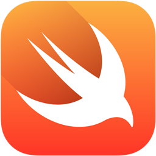

# Space Tyckiting Swift client



*Author: Markus Kauppila*

## Synopsis

Nothing.

## Prerequisites

Install latest Xcode from Mac AppStore.
Open Xcode and install the command line tools.

## How-to start with new AI?

Currently there's one pre-made AI in `TyckitingClient` folder that can be used as template.
- Copy the `DummyAI.swift` to `YourBot.swift`
- Add `YourBot.swift` to the Xcode project
- Add your AI to `createAI` method in `Client.swift`
- Pass command line arguments to client by editing schemes and adding them to run action
- Run the custom AI from Xcode (`Product` -> `Run`)

Note: You can pass arguments to app by editing its scheme. See [Apple's documentation](https://developer.apple.com/library/mac/recipes/xcode_help-scheme_editor/Articles/SchemeRun.html) for details.

## Testing

The tests are in `TyckitingClientTests/`, follow the example and add your owns tests.

## Editors

Xcode and AppCode by Jetbrains are the simplest options. Both of them integrate the entire toolchain for building and running the app.

Alternatively, use whatever editor you want for writing the code. I'd recommend something with proper Swift syntax highlightin such as Vim or Atom.io, though bothe of them require a plug-in for the syntax highlighting. Allegedly, Microsoft's Visual Studio Code has Swift syntax highlighting built-in and it runs on OS X and Linux. If you feel adventurous, give it a try.

Then build and run the project
````
xcodebuild -project TyckitingClient.xcodeproj/ #build
ln -s build/Release/TyckitingClient.app/Contents/MacOS/TyckitingClient tyckitin
./tyckitin
````

## Learning materials

- [Swift](https://developer.apple.com/swift/)
- [The Swift Programming Language](https://developer.apple.com/library/ios/documentation/Swift/Conceptual/Swift_Programming_Language/)
- [Swift Tutorial: A Quick Start](http://www.raywenderlich.com/74438/swift-tutorial-a-quick-start)
- [LearnSwift.tips](http://www.learnswift.tips/)
